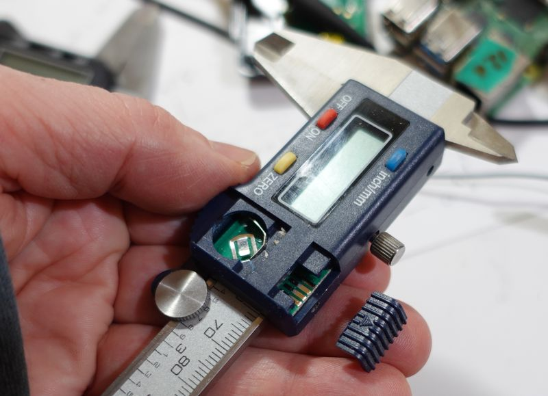
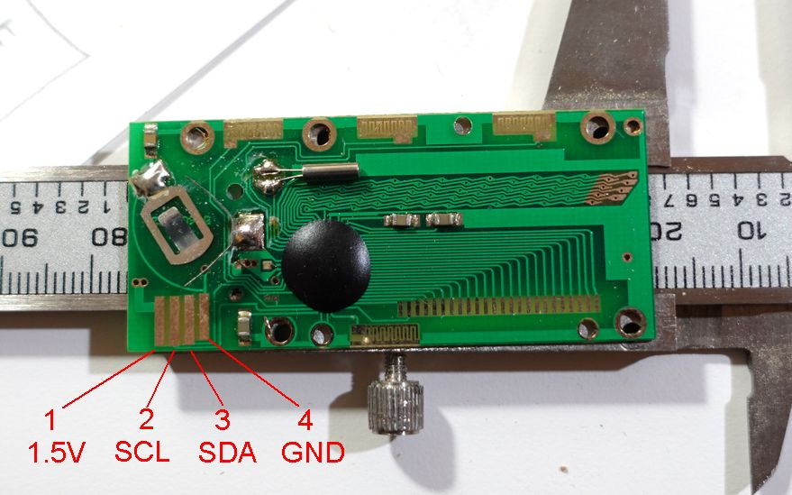
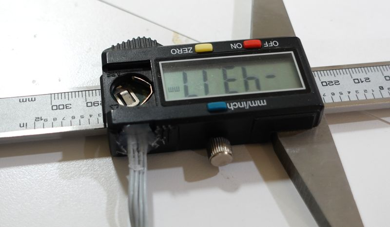
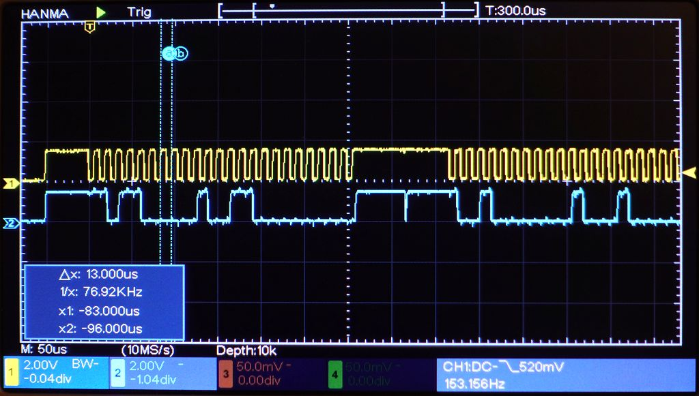
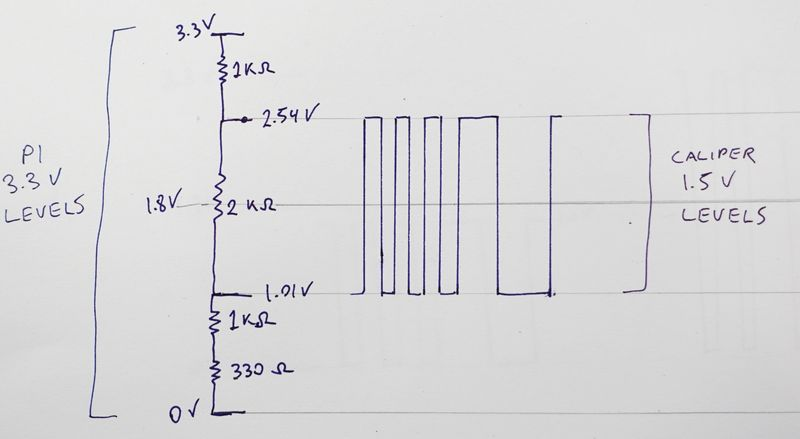
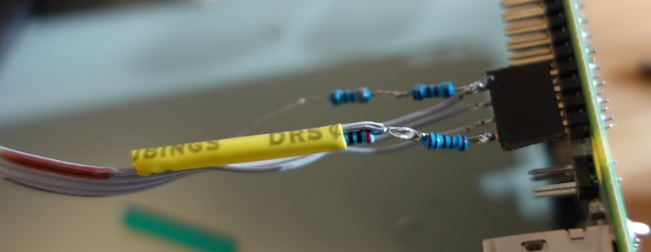
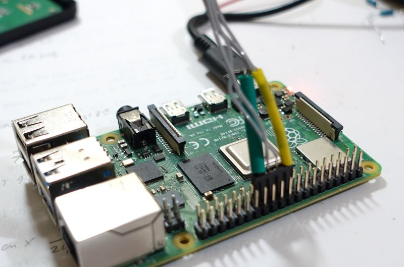

<html>
<h1>Interfacing cheap digital calipers to Raspberry Pi</h1>

Cheap digital calipers have a 4-pin digital interface in the form of four pads
on the circuit board.  These can be used to connect the caliper to a computer.

Most of these calipers have part of the plastic cover that can be slid off to reveal
four pads on the circuit board.  The geometry of this opening varies, and I don't
know of where one could buy a connector to fit.

Below: Caliper disassembled to reveal the circuit board.  You will have to peel the sticker off
the back of the caliper to get at the screws that hold it together.

Pinout of header connector on calipers, left to right,
Looking at top of PCB with the edge connector traces facing you:

<table>
<tr><td><b>Pin<td><b>Function
<tr><td>1<td>1.5 volt (connects to battery)
<tr><td>2<td>Clock
<tr><td>3<td>Data
<tr><td>4<td>Ground
</table>

As these calipers don't cost much, and no suitable connector,
I just soldered wires to the pads, then applied hot glue
to keep the wire from bending at the solder joints so they won't break.

The caliper outputs two 24 bit words with synchronous serial at 76.8 kbaud
three times a second.

However, output levels are just 1.5 volt logic as the caliper runs
off a 1.5 volt battery.  Below, yellow is clock line, blue is data line.

For the Raspbery Pi, the threshold between zero and one on the inputs
is 1.8 volts, so even 1.5 volts from the caliper is not enough to
register as high (1) for the Raspbery Pi.

A voltage divider with 1.3k to ground, 2k across supply of caliper
and 1k to +3.3 volts puts the 1.5 volt supply if the caliper so that it
straddles the 1.8 volts hi/low GPIO input threshold of the Pi.  This voltage divider
also provides power to the caliper, as the caliper uses minimal power and
I don't like to leave batteries in them as they drain the batteries in a matter
of months even while turned off.

<pre>
Gnd ---\/\/\/----\/\/\/--+--\/\/\/--+--\/\/\/---- 3.3V
         1K       330    |    2K    |    1K
                         |          |
                         +- 1.5 V --+
                          To calliper
</pre>

I soldered the four resistors for the voltage divider onto a four pin
header that plugs into the Raspbery Pi.  Breadboard is fine for experimenting
but if I want to use something, I prefer to just solder it together compactly.
I already have some heat shrink tubing ready to slide over two of the resistors,
more heat shrink tubing was added later.

<b>Physical wring to Raspberry Pi 40-pin GPIO header:</b>
<table>
<tr><th>Pi pin<th>Pi function<th>Calipers
<tr><td>19<td>GPIO 19<td>VCC
<tr><td>21<td>GPIO 21<td>Clock
<tr><td>23<td>GPIO 23<td>Data
<tr><td>25<td>Ground<td>GROUND
</table>

Here plugged into pins 19,21,23 and 25 on the Raspberry Pi 4.  These are the pins
my code assumes.  I chose these pins to not interfere with other peripherals that
I have plugged into the Raspbery Pi on my setup.  I just use
general purpose GPIO pins, so the connector could be plugged into the header just
about anywere if the code is changed accordingly.  I drive one output to high
to provide power for the voltage divider, as current requirements are minimal
and I didn't want to use up one of the 3.3 volt supply pins on the header.

The caliper puts out two signed 24 bit words, synchronous serial, 76.8 kbits per second,
three times per second.  These are LSB first, encoding the position as 20480 increments per inch.

The first 24 bit word is an absolute reading, with zero being where the caliper was
when it was turned on.  The second 24 bit value is the negative
of what is on the display.  Pushing zero on the caliper resets this value
to zero for the current position.  Note that the 24 bit words have a resolution about
eight times higher than what is on the display, but the LSBs jump around a little bit.

I first wrote a pyton program <b>decode_caliper.py</b> to bit-bang decode the syncronous serial.  However,
this program was barely fast enough on a raspberry pi 4.

So I re-wrote it in c, <b>decode_caliper.c</b>.  Unlike the python program, this needs
to run as root.

